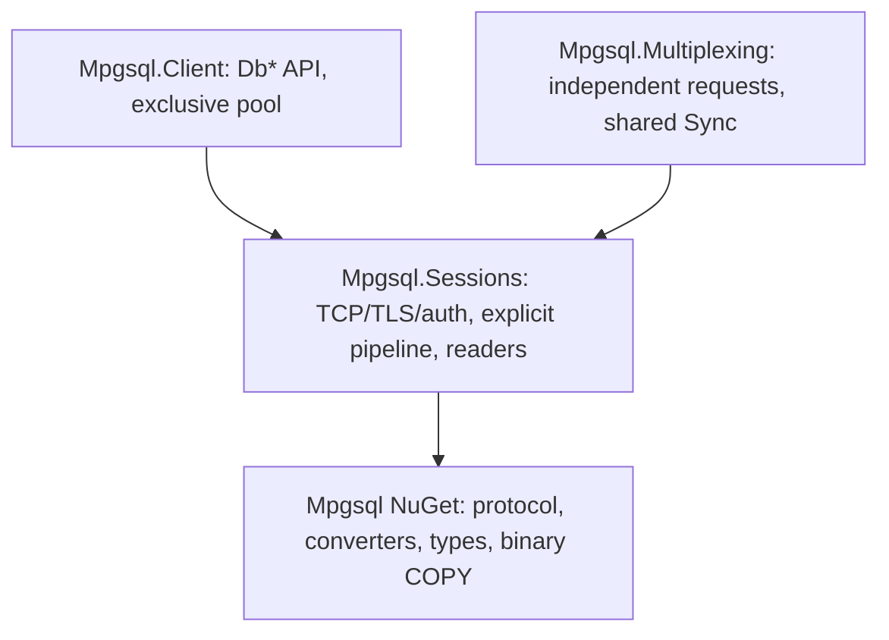

# Asynchronous ADO.NET and request multiplexing

The assemblies retain the `Mpgsql` namespace. `Mpgsql` is the independently packable
protocol/converter/type/binary COPY library. `Mpgsql.Sessions` owns TCP/TLS,
authentication, CancelRequest, explicit pipelines and result buffers.
`Mpgsql.Client` and `Mpgsql.Multiplexing` each reference Sessions; neither references
the other. All upper assemblies target .NET 10 and are non-packable.



## Connecting and reusable commands

```csharp
await using var source = new MpgsqlDataSource(
    "Host=localhost;Username=app;Database=app;Password=secret;Ssl Mode=VerifyFull");
await using var connection = await source.OpenConnectionAsync(cancellationToken);
await using var command = connection.CreateCommand("select $1::bigint");
var parameter = new MpgsqlParameter<long>(TypeOid.Int64, 42);
command.Parameters.Add(parameter);
var first = await command.ExecuteScalarAsync<long>(cancellationToken);
parameter.TypedValue = 43;
var second = await command.ExecuteScalarAsync<long>(cancellationToken);
```

The same provider works through `DbDataSource`, `DbConnection`, `DbCommand`,
`DbParameter`, `DbTransaction`, `DbBatch` and `DbDataReader`.
`MpgsqlFactory.Instance` creates provider objects. Standard methods return `Task`,
`object` and `int`; `ExecuteReaderValueTaskAsync`, generic `ExecuteScalarAsync<T>`
and `ExecuteNonQuery64Async` provide the typed ValueTask path. Standard non-query
execution uses a checked conversion to `int` after protocol completion.
Standard scalar returns `null` for no row and `DBNull.Value` for SQL NULL.
The generic scalar result separately reports `HasRow`, `IsNull` and `Value`.

A data-source command can open and return its own exclusive lease:

```csharp
await using var command = source.CreateCommand("select $1::text");
command.Parameters.Add(MpgsqlParameter.Text("hello"));
object? value = await command.ExecuteScalarAsync(cancellationToken);
```

An explicitly constructed `MpgsqlConnection(connectionString)` owns its transport.
The source pool is local to that source, with no global pool. Defaults: localhost,
port 5432, required Username, database equal to Username, open timeout 15 seconds,
command timeout 0, maximum 10 sessions, row budget 8 MiB per session, recovery
timeout 5 seconds. Unknown settings are rejected. `MpgsqlConnectionStringBuilder`
exposes these settings and a custom `RootCertificate` PEM path.

Startup uses protocol 3.0 and UTF8, retains BackendKeyData/ParameterStatus, and
supports trust, cleartext, MD5 and SCRAM-SHA-256 with server signature verification
and PostgreSQL SASLprep fallback for Unicode passwords. TLS modes are Disable,
Require, VerifyCA and VerifyFull; VerifyFull is the default. Require encrypts
without certificate validation; VerifyCA verifies the chain, and VerifyFull also
verifies the hostname. There is one TCP endpoint. Unix sockets, multi-host,
GSS/SSPI and SCRAM-PLUS are unsupported.

## Parameters and execution ownership

Only text commands and positional `$1`, `$2`, ... placeholders are supported.
Every parameter needs an explicit supported PostgreSQL OID or `DbType`. There is
no type inference or SQL rewriting. ParameterName is collection metadata, with
exact name lookup. Only input parameters are accepted.

`MpgsqlParameter<T>.TypedValue` avoids `object` on the typed input path. Existing
scalar, nullable and array representations remain available: jsonb is
`Memory<byte>`, arrays use `ReadOnlyMemory<T>` (including nullable elements), and
raw UTF8 overloads remain available through `MpgsqlParameterValue` and
`MpgsqlParameter.FromValue`. Borrowed parameter memory must stay valid and must
not be changed until execution finishes; the provider freezes its parameter
properties, not the caller's underlying memory.

Commands and batches can be changed and executed again after their previous
reader/execution finishes. SQL, parameter collections, parameter values and
connection/transaction ownership are frozen while executing. A connection permits
one active operation or reader. The full batch is validated before any message
is admitted. Every command/batch has one independent automatic Sync; skipped
operations after an error are not confirmed or retried.

## Batches, transactions and preparation

```csharp
await using var transaction = await connection.BeginTransactionAsync(cancellationToken);
await using var batch = connection.CreateBatch();
batch.Transaction = (MpgsqlTransaction)transaction;
var insert = new MpgsqlBatchCommand("insert into items(value) values ($1)");
insert.Parameters.Add(MpgsqlParameter.Int64(7));
batch.BatchCommands.Add(insert);
batch.BatchCommands.Add(new MpgsqlBatchCommand("select value from items"));
await using (var reader = await batch.ExecuteReaderAsync(cancellationToken))
{
    do { while (await reader.ReadAsync(cancellationToken)) { /* read this result */ } }
    while (await reader.NextResultAsync(cancellationToken));
}
await transaction.CommitAsync(cancellationToken);
```

Local transactions default to ReadCommitted and also support ReadUncommitted,
RepeatableRead and Serializable. Async disposal rolls back an unfinished
transaction. Nested transactions, savepoints and ambient transactions are
unsupported. Batches and preparation require an explicitly open connection.

`PrepareAsync` prepares named statements on the current physical session.
SQL/connection/OID/parameter-count changes require `UnprepareAsync`; parameter
values can change between executions. Unprepare explicitly sends Close and Sync.
Command disposal only releases local ownership; it sends no hidden statement
Close. Session statement retention and raw prepared-handle lifecycle remain in
Sessions. Prepared handles cannot migrate to another physical session.

## Reading, cancellation and closing

The reader exposes column metadata, indexers, GetValue/GetValues, typed getters,
IsDBNull, RecordsAffected and asynchronous movement. HasRows prefetches one row
without copying payload. `GetRawValue` returns borrowed bytes valid until the
next movement, reader/group close, or owner disposal. Decoded strings and arrays
own their memory. Object materialization uses the documented converter
representations (including PgNumeric and PostgreSQL date/time types).

`GetFieldValue<T>(ordinal)` also reads custom CLR values registered with an explicit
OID and binary decoder. For example, set `MpgsqlDataSourceOptions.TypeMapper` to
`new MpgsqlTypeMapper().Register<MyType>(oid, bytes => DecodeMyType(bytes))`.
A source copies an immutable registration snapshot; standalone connections have a
`TypeMapper` property configurable while closed. The custom decoder runs on the
caller's getter and must respect borrowed-byte lifetime. Built-in decoders retain
their direct path; only custom types search the registry. Object GetValue/schema
materialization of custom types is not inferred from registrations.

Supported behaviors: Default, SequentialAccess and CloseConnection.
SequentialAccess uses the existing buffered row; it does not stream an individual
field. GetBytes validates source and destination bounds before writing and leaves
the destination unchanged on validation failure. Synchronous getters work;
synchronous Open, Execute, Read, NextResult, Prepare and transaction network
operations throw NotSupportedException. Extended schema discovery, DataAdapter,
CommandBuilder and other CommandBehavior flags are unsupported.

Cancellation token, Cancel () and optional command timeout apply to the current
execution. After publication, CancelRequest uses a separate channel; the lease
stays held until that channel closes and ReadyForQuery restores the protocol.
No later execution can inherit a pending cancellation. The default zero command
timeout allocates no timer. SQL/transport errors on the ADO.NET boundary derive
from DbException; MpgsqlPostgresException retains SQLSTATE and diagnostics.

The verification matrix exposes a pg_doorman 3.10.6 session-mode limitation:
a second CancelRequest loses its pooler target mapping. Bounded recovery retires
that connection, requiring explicit reopen. See the source evidence and fixture
behavior in [the verification report](ado-refactor-verification.md).

Synchronous Close/Dispose aborts an active physical session and never blocks on
network recovery. Async close/disposal can discard results and finish recovery,
allowing reuse. Pools return only healthy idle sessions; unfinished transactions
and failed recovery retire the session. Returning a session sends no reset SQL.
`ClearSessionStateAsync` remains an explicit mask for RESET ALL, UNLISTEN *,
advisory unlock, cursor close and temporary-object cleanup.

## Independent multiplexed requests

```csharp
await using var source = new MpgsqlMultiplexingDataSource(
    new MpgsqlSessionOptions { Username = "app", Database = "app", Password = password },
    new MpgsqlMultiplexingOptions { MaxConnections = 4, MaxInFlightPerConnection = 8,
        SyncGroupSize = 4, SyncGroupTimeout = TimeSpan.FromMilliseconds(1) });
var result = await source.ExecuteScalarAsync<long>("select $1::bigint",
    new[] { MpgsqlParameterValue.Int64(42) }, cancellationToken);
```

This source owns independent requests, scheduling/backpressure and logical
cancellation. Its factory transfers ownership of an authenticated idle session.
It has no ADO.NET connections. Group size greater than one explicitly shares
transaction/error boundaries. A failure identifies the failing request and
skipped requests using MpgsqlServerException/MpgsqlSyncGroupException. Logical
cancellation drains the request while preserving other callers' work and Sync.
The low-level MpgsqlMessageSession API remains in Sessions with explicit
SendSyncAsync and multiple closed groups in flight.
