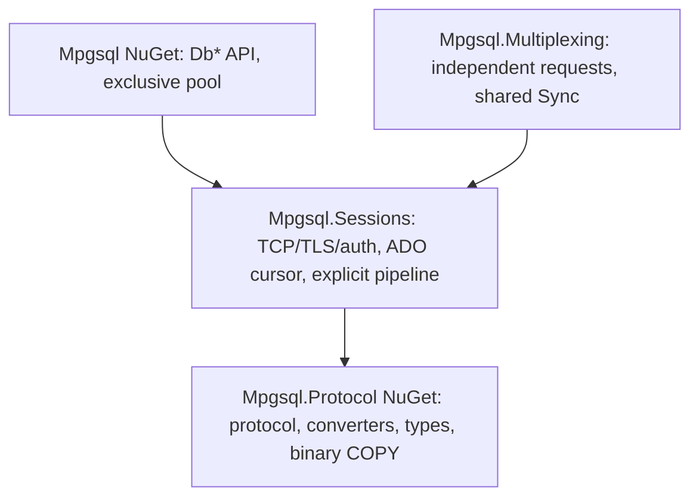

# Asynchronous ADO.NET and request multiplexing

The assemblies retain the `Mpgsql` namespace. `Mpgsql.Protocol` is the independently packable
protocol/converter/type/binary COPY library. `Mpgsql.Sessions` owns TCP/TLS,
authentication, CancelRequest, explicit pipelines and result buffers.
`Mpgsql` and `Mpgsql.Multiplexing` each reference Sessions; neither references
the other. All assemblies target .NET 10. The `Mpgsql` NuGet package includes
`Mpgsql.Sessions.dll` and depends on `Mpgsql.Protocol`; Sessions and Multiplexing
remain non-packable projects.



## Connecting and reusable commands

```csharp
await using var source = new MpgsqlDataSource(
    "Host=localhost;Username=app;Database=app;Password=secret;Ssl Mode=VerifyFull");
await using var connection = await source.OpenConnectionAsync(cancellationToken);
await using var command = connection.CreateCommand("select $1::bigint");
var parameter = new MpgsqlParameter<long>(TypeOid.Int64, 42);
command.Parameters.Add(parameter);
var first = await command.ExecuteScalarAsync<long>(cancellationToken);
parameter.TypedValue = 43;
var second = await command.ExecuteScalarAsync<long>(cancellationToken);
```

The same provider works through `DbDataSource`, `DbConnection`, `DbCommand`,
`DbParameter`, `DbTransaction`, `DbBatch` and `DbDataReader`.
`MpgsqlFactory.Instance` creates provider objects. Standard methods return `Task`,
`object` and `int`; `ExecuteReaderValueTaskAsync`, generic `ExecuteScalarAsync<T>`
and `ExecuteNonQuery64Async` provide the typed ValueTask path. Standard non-query
execution uses a checked conversion to `int` after protocol completion.
Standard scalar returns `null` for no row and `DBNull.Value` for SQL NULL.
The generic scalar result separately reports `HasRow`, `IsNull` and `Value`.

A data-source command can open and return its own exclusive lease:

```csharp
await using var command = source.CreateCommand("select $1::text");
command.Parameters.Add(MpgsqlParameter.Text("hello"));
object? value = await command.ExecuteScalarAsync(cancellationToken);
```

An explicitly constructed `MpgsqlConnection(connectionString)` owns its transport.
The source pool is local to that source, with no global pool. Defaults: localhost,
port 5432, required Username, database equal to Username, open timeout 15 seconds,
command timeout 0, maximum 10 sessions, row budget 8 MiB per session, recovery
timeout 5 seconds. Unknown settings are rejected. `MpgsqlConnectionStringBuilder`
exposes these settings and a custom `RootCertificate` PEM path.

TCP transports use a 32 KiB read buffer. The 1024-byte minimum read size controls
when another segment is allocated; a read returns after one stream read.
The provider's result path is `MpgsqlCommand`/`MpgsqlBatch` → `QueryExecution` →
the internal `Mpgsql.Internal.AdoCursor` in Sessions. A cursor belongs to one
execution and owns its response order, result transitions, current row and
movement/disposal admission. The provider does not construct the general
`MpgsqlQueryBatch` or `MpgsqlResultReader`. `QueryExecution` remains the upper
owner of the exclusive lease, cancellation, recovery and final cleanup.
Writer control is shared through the narrow internal `IQueryGroup` contract;
it does not dispatch rows or getters. Explicit pipelines and Multiplexing retain
their concrete query batches, result readers and background receive path.

The ADO cursor reads backend frames on reader movement. A complete
DataRow borrows the outstanding transport buffer until the next movement or
close, with one reusable field index and no per-row payload copy or event queue.
The cursor handles metadata, row and command completion transitions directly.
Wire codecs, `BorrowedRow`, frame assembly and transport input remain shared;
interleaved asynchronous messages retain the session's control-message routing.
Fragmented frames use the session's assembly buffer. Holding a row can apply
transport backpressure; a server/test producer and the consumer must run
independently. Cancellation and asynchronous close invalidate the reader, wait
for its active movement, and drain through ReadyForQuery before returning the
lease. These rules also cover preparation and transaction commands without a
public reader.

Existing Db* and typed ValueTask signatures are preserved; a closed or disposed
public reader is not reused for another execution. The additional typed portion
API below uses the same exclusive cursor. Each execution owns its cursor state.

ADO input installs one internal lifetime wake per session. Input reads avoid a
per-read lifetime-token registration; cancellation still wakes the current or
next `PipeReader` read. Disposal detaches this wake after the input owner is idle
and before completing the input endpoint.

One timer per ADO session observes idle periods with a 20 ms grace and 20 ms
timer period. It starts a control-only input owner while there is no operation,
pending write, recovery or active input read. That owner routes asynchronous
messages and observes terminal diagnostics or EOF, so an idle FATAL completes
`Session.Completion` without requiring another query. Timer scheduling is best
effort; 20 ms is an activation grace, not a notification deadline. This monitor
creates no row queue. Query admission cancels its private read token and the
writer/reader awaits input handoff before publishing or consuming operation
responses. Buffered diagnostics and partial control frames retain their idle
attribution across that handoff. Disposal stops the timer and waits for its input
owner before completing the endpoint.

Small prevalidated command groups
(including Sync, less than 64 KiB and fewer than 256 commands) can use the existing
inline writer when the output is idle. Only a small batch with more than one
command preposts its input read before writing; a single query starts reading
in the normal response order. Larger groups retain the writer FIFO.

Explicit pipeline sessions and the request multiplexer retain their background
receive loop and owned-row queues. Their row storage uses the following limits.
The row budget counts serialized row payload; storage objects, metadata and
buffer capacity also consume memory. Small borrowed rows use reusable private
buffers of 16/32/64/128 bytes; an existing larger buffer is retained for reuse.
The session caches at most 4096 inactive storage objects and 31 additional
receive-loop rentals. Their private buffers retain at most 4127 * 128 = 528256
bytes per session, plus array and storage-object overhead. This bound applies to
inactive storage; active rows and other buffers consume memory independently.

Startup uses protocol 3.0 and UTF8, retains BackendKeyData/ParameterStatus, and
supports trust, cleartext, MD5 and SCRAM-SHA-256 with server signature verification
and PostgreSQL SASLprep fallback for Unicode passwords. TLS modes are Disable,
Require, VerifyCA and VerifyFull; VerifyFull is the default. Require encrypts
without certificate validation; VerifyCA verifies the chain, and VerifyFull also
verifies the hostname. There is one TCP endpoint. Unix sockets, multi-host,
GSS/SSPI and SCRAM-PLUS are unsupported.

## Typed reading in portions

`MpgsqlDataReader` exposes two additional `ValueTask<int>` methods for large
results. These are separate from the ordinary `DbDataReader.ReadAsync()` API:

```csharp
await using var reader = await command.ExecuteReaderValueTaskAsync(cancellationToken);
var values = new long[4096];
int count;
while ((count = await reader.ReadColumnAsync<long>(0, values.AsMemory(), cancellationToken)) != 0)
{
    Consume(values.AsSpan(0, count));
}
// Explicitly advance a batch to its next result, or dispose the reader.
```

`ReadColumnAsync<T>(ordinal, Memory<T>, token)` fills one column with the same
explicit OID/CLR representations as `GetFieldValue<T>`. It resolves binary format,
builtin support and custom mapping once per portion. Supported nullable and
reference types retain SQL NULL as `default`; `object` retains `DBNull.Value`.
Builtin mapping takes precedence over custom registrations. Array, bytea and
jsonb converters keep their existing owning representations.

For records, implement a struct mapper with a synchronous `Read(MpgsqlRow)`:

```csharp
readonly record struct Person(long Id, string? Name);

readonly struct PersonMapper : IMpgsqlRowMapper<Person>
{
    public Person Read(MpgsqlRow row)
        => new(row.GetFieldValue<long>(0), row.GetFieldValue<string>(1));
}

// Inside the consuming async method:
var people = new Person[1024];
int count = await reader.ReadRowsAsync<Person, PersonMapper>(
    people.AsMemory(), default, cancellationToken);
Consume(people.AsSpan(0, count));
```

`MpgsqlRow` is a readonly ref struct with typed getters, `IsDBNull`, metadata and
`GetRawValue`, with no movement or close methods. The mapper runs on the consuming
call after a row is available, never from a background session reader or writer.
Struct mapper calls use a constrained generic call; no delegate or boxed mapper
is created per row. Returned records and custom converted values must own any
data they retain. Bytes from `GetRawValue` are borrowed and must be consumed or
copied before the mapper returns; the driver does not inspect arbitrary records
or silently copy their fields.

Both methods hold one cursor movement guard for the entire portion, including
decoding and destination writes. A competing ordinary Read, NextResult or bulk
movement is rejected before modifying reader state or discarding the active
owner. Protocol framing and field bounds are still checked by the existing row
decoder. Cancellation is registered once per portion; network waits remain async.

The methods start at the next unread row, including the initially prefetched row.
A row already returned by ordinary Read is not repeated. They only consume the
current result: filling the entire destination does no lookahead and leaves the
last row positioned; a short fill reaches its end and leaves no current row.
`NextResultAsync` remains explicit. Zero capacity returns zero without movement
or cancellation registration; column ordinal/type validation still applies.
A completed reader returns zero. A zero count with an empty destination is not
an end-of-result test. The caller must keep destination memory valid until the
ValueTask completes; only its filled prefix is written and the tail is untouched.

Getter/mapper errors preserve the original exception, the already written prefix
and the failing current row; its destination slot is not assigned. The operation
is not atomic and a throwing ValueTask does not return the written count. The
caller may inspect that row or advance past it. Wire errors and cancellation
release the cursor guard before the usual discard/recovery through ReadyForQuery.
Asynchronous close waits until the held row is no longer being decoded.
Synchronous close aborts the physical session without waiting; borrowed input
is released after the active portion gives up its cursor guard.

Bulk performance must be measured separately from row-by-row API performance.
The separate column/record benchmark source compares equal full destination
writes at 64/256/4096/65536 rows and capacities 256/4096/full result. Capacity is
clamped to the row count, and metadata records the actual slice size. For 64 and
256 rows all three settings select the full result; 4096/full also coincide for
4096 rows. These duplicates are not independent performance evidence; see
[README.AdoBulk.md](../benchmarks/Mpgsql.Benchmarks/README.AdoBulk.md).
Two complete repetitions ran on 2026-10-09; setup/cleanup checks passed.
A repeatable 10% bulk advantage at 65536 rows was not established. Full-column
mean latency was 7.60%/4.01% below Npgsql, with overlapping individual confidence
intervals. These exploratory results do not establish general provider speedup.

## Parameters and execution ownership

Only text commands and positional `$1`, `$2`, ... placeholders are supported.
Every parameter needs an explicit supported PostgreSQL OID or `DbType`. There is
no type inference or SQL rewriting. ParameterName is collection metadata, with
exact name lookup. Only input parameters are accepted.

`MpgsqlParameter<T>.TypedValue` avoids `object` on the typed input path. Existing
scalar, nullable and array representations remain available: jsonb is
`Memory<byte>`, arrays use `ReadOnlyMemory<T>` (including nullable elements), and
raw UTF8 overloads remain available through `MpgsqlParameterValue` and
`MpgsqlParameter.FromValue`. Borrowed parameter memory must stay valid and must
not be changed until execution finishes; the provider freezes its parameter
properties, not the caller's underlying memory.

Commands and batches can be changed and executed again after their previous
reader/execution finishes. SQL, parameter collections, parameter values and
connection/transaction ownership are frozen while executing. A connection permits
one active operation or reader. The full batch is validated before any message
is admitted. Every command/batch has one independent automatic Sync; skipped
operations after an error are not confirmed or retried. The connection attaches
the execution to its command/batch owner before publication, so cancellation
reentered during inline encoding targets that current execution.

## Batches, transactions and preparation

```csharp
await using var transaction = await connection.BeginTransactionAsync(cancellationToken);
await using var batch = connection.CreateBatch();
batch.Transaction = (MpgsqlTransaction)transaction;
var insert = new MpgsqlBatchCommand("insert into items(value) values ($1)");
insert.Parameters.Add(MpgsqlParameter.Int64(7));
batch.BatchCommands.Add(insert);
batch.BatchCommands.Add(new MpgsqlBatchCommand("select value from items"));
await using (var reader = await batch.ExecuteReaderAsync(cancellationToken))
{
    do { while (await reader.ReadAsync(cancellationToken)) { /* read this result */ } }
    while (await reader.NextResultAsync(cancellationToken));
}
await transaction.CommitAsync(cancellationToken);
```

Local transactions default to ReadCommitted and also support ReadUncommitted,
RepeatableRead and Serializable. Async disposal rolls back an unfinished
transaction. Nested transactions, savepoints and ambient transactions are
unsupported. Batches and preparation require an explicitly open connection.

`PrepareAsync` prepares named statements on the current physical session.
SQL/connection/OID/parameter-count changes require `UnprepareAsync`; parameter
values can change between executions. Unprepare explicitly sends Close and Sync.
Command disposal only releases local ownership; it sends no hidden statement
Close. Session statement retention and raw prepared-handle lifecycle remain in
Sessions. Prepared handles cannot migrate to another physical session.

## Reading, cancellation and closing

The reader exposes column metadata, indexers, GetValue/GetValues, typed getters,
IsDBNull, RecordsAffected and asynchronous movement. ADO cursor initialization
accepts the first result description and prefetches its first row or command end
under one movement claim. Its execution owner is attached before the first input
read, so cancellation and owner disposal wait for this entire initialization.
HasRows uses the prefetched result; getters remain unavailable until the first
public ReadAsync positions the reader. Public low-level ReadResultsAsync still
returns after metadata, before the first row arrives.

`GetRawValue` returns borrowed bytes valid until the
next movement, reader/group close, or owner disposal. Decoded strings and arrays
own their memory. Object materialization uses the documented converter
representations (including PgNumeric and PostgreSQL date/time types).

`GetFieldValue<T>(ordinal)` also reads custom CLR values registered with an explicit
OID and binary decoder. For example, set `MpgsqlDataSourceOptions.TypeMapper` to
`new MpgsqlTypeMapper().Register<MyType>(oid, bytes => DecodeMyType(bytes))`.
A source copies an immutable registration snapshot; standalone connections have a
`TypeMapper` property configurable while closed. The custom decoder runs on the
caller's getter and must respect borrowed-byte lifetime. Built-in decoders retain
their direct path; only custom types search the registry. Object GetValue/schema
materialization of custom types is not inferred from registrations.

Supported behaviors: Default, SequentialAccess and CloseConnection.
SequentialAccess uses the existing buffered row; it does not stream an individual
field. GetBytes validates source and destination bounds before writing and leaves
the destination unchanged on validation failure. Synchronous getters work;
synchronous Open, Execute, Read, NextResult, Prepare and transaction network
operations throw NotSupportedException. Extended schema discovery, DataAdapter,
CommandBuilder and other CommandBehavior flags are unsupported.

Cancellation token, Cancel () and optional command timeout apply to the current
execution. After publication, CancelRequest uses a separate channel; the lease
stays held until that channel closes and ReadyForQuery restores the protocol.
No later execution can inherit a pending cancellation. The default zero command
timeout allocates no timer. SQL/transport errors on the ADO.NET boundary derive
from DbException; MpgsqlPostgresException retains SQLSTATE and diagnostics.

The verification matrix exposes a pg_doorman 3.10.6 session-mode limitation:
a second CancelRequest loses its pooler target mapping. Bounded recovery retires
that connection, requiring explicit reopen. See the source evidence and fixture
behavior in [the verification report](ado-refactor-verification.md).

Synchronous Close/Dispose aborts an active physical session and never blocks on
network recovery. Async close/disposal can discard results and finish recovery,
allowing reuse. Pools return only healthy idle sessions; unfinished transactions
and failed recovery retire the session. Returning a session sends no reset SQL.
`ClearSessionStateAsync` remains an explicit mask for RESET ALL, UNLISTEN *,
advisory unlock, cursor close and temporary-object cleanup.

## Independent multiplexed requests

```csharp
await using var source = new MpgsqlMultiplexingDataSource(
    new MpgsqlSessionOptions { Username = "app", Database = "app", Password = password },
    new MpgsqlMultiplexingOptions { MaxConnections = 4, MaxInFlightPerConnection = 8,
        SyncGroupSize = 4, SyncGroupTimeout = TimeSpan.FromMilliseconds(1) });
var result = await source.ExecuteScalarAsync<long>("select $1::bigint",
    new[] { MpgsqlParameterValue.Int64(42) }, cancellationToken);
```

This source owns independent requests, scheduling/backpressure and logical
cancellation. Its factory transfers ownership of an authenticated idle session.
It has no ADO.NET connections. Group size greater than one explicitly shares
transaction/error boundaries. A failure identifies the failing request and
skipped requests using MpgsqlServerException/MpgsqlSyncGroupException. Logical
cancellation drains the request while preserving other callers' work and Sync.
The low-level MpgsqlMessageSession API remains in Sessions with explicit
SendSyncAsync and multiple closed groups in flight.
